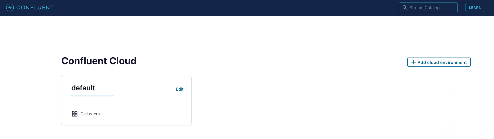
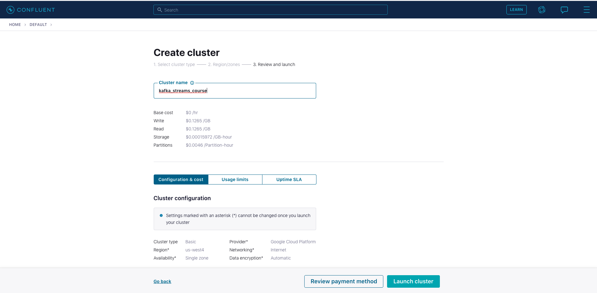
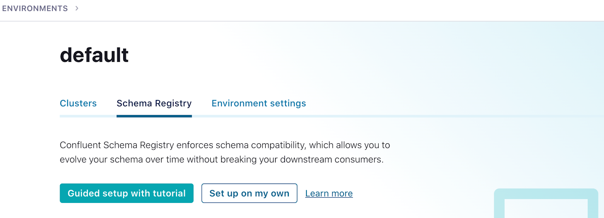
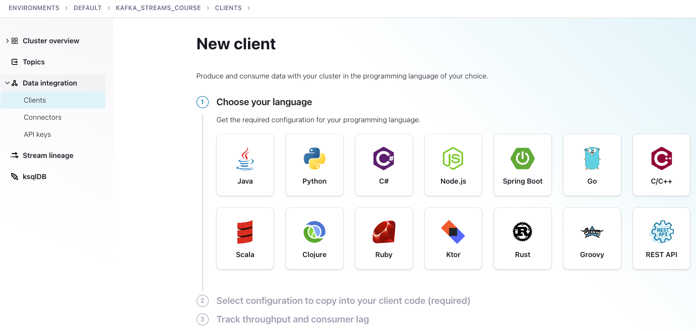
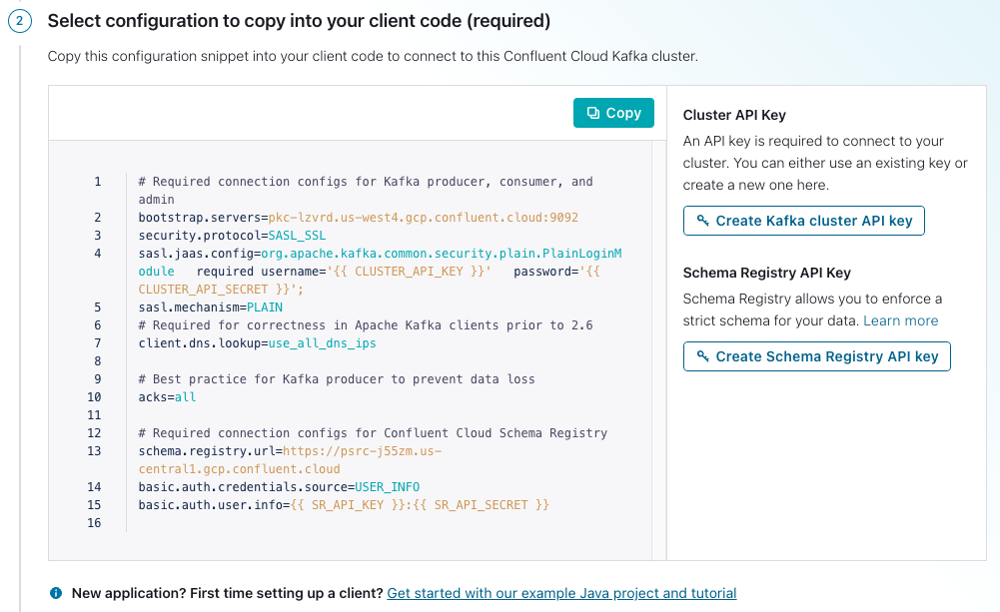

# Kafka Streams Demo

This is modified code of the [Kafka Streams 101 course](https://developer.confluent.io/learn-kafka/kafka-streams/get-started/).

##  Confluent Cloud
 
1. Go to [Confluent Cloud](https://www.confluent.io/confluent-cloud/tryfree?utm_source=learnkafka). 
   If you don’t already have a Confluent Cloud account you can create one here. Use promotion code <TBC> for money off your cloud bill.
2. Once logged into your cloud account click on the `Add cloud environment button` on the right-hand side of the screen.  Name the environment something like `kafka_streams_course_env`.  You can also choose to use the `default` environment already present.  Using a new environment gives you the ability to keep resources separate on your Confluent account.
   
3. Click on the environment you just created or the `default` environment tile. Create a new cluster by clicking on `Create cluster on my own`.  For the purposes of all the exercise modules you can use the `Basic` type. 
   Name the cluster `kafka_streams_course`. Then click on the `Launch Cluster` button on the bottom right.
   
4. You’ll also need to set up a Schema Registry. Click on the environment link in the upper left corner, either `default` or the name of the environment you created. 
   Then click the Schema Registry tab and follow the prompts to set up a schema registry on the provider of your choice. Once that is complete, go back to your cluster.
   
5. Next click on `Data Integration` in the menu on the left, then select `Clients`, then the `Java` tile.
     
   
6. After step three above, you'll go to a page where you can create credentials for your cluster and Schema Registry.                               
   

   1. Click on `Create Kafka cluster API key`.
   2. Copy your key and secret, name the file, then click `Download and continue`. (Your credentials will populate into the configurations boilerplate.)
   3. Click on `Create Schema Registry API key`.
   4. Copy your key and secret, name the file, then click `Download and continue`. (Your credentials will populate into the configurations boilerplate.)
   5. Make sure `Show API keys` is selected, then `Copy` the configurations in the window.
   6. Create a file named `ccloud.properties` in the `src/main/resources` directory of the cloned repo. Then paste the configurations into a file named `ccloud.properties`. Note that this file is ignored and should never get checked into GitHub.
       
Here's what you `ccloud.properties` file should look like except the values inside the `{{ }}` braces will have the 
required credentials
```text
# Required connection configs for Kafka producer, consumer, and admin
bootstrap.servers={{ BOOTSTRAP_SERVERS }}
security.protocol=SASL_SSL
sasl.jaas.config=org.apache.kafka.common.security.plain.PlainLoginModule   required username='{{ CLUSTER_API_KEY }}'   password='{{ CLUSTER_API_SECRET }}';
sasl.mechanism=PLAIN
# Required for correctness in Apache Kafka clients prior to 2.6
client.dns.lookup=use_all_dns_ips

# Best practice for Kafka producer to prevent data loss
acks=all

# Required connection configs for Confluent Cloud Schema Registry
schema.registry.url={{ SR_URL }}
basic.auth.credentials.source=USER_INFO
basic.auth.user.info={{ SR_API_KEY }}:{{ SR_API_SECRET }}
```

## Setting up properties for running the demo code
Now we're going to set up properties for the demo.  You are taking a couple of minor extra steps to make sure
that any sensitive information doesn't get accidentally checked into GitHub.  Run the following commands:

1. cd into the `src/main/resources` directory
2. cat `streams.properties.orig` > `streams.properties`
3. cat `ccloud.properties` >> `streams.properties`